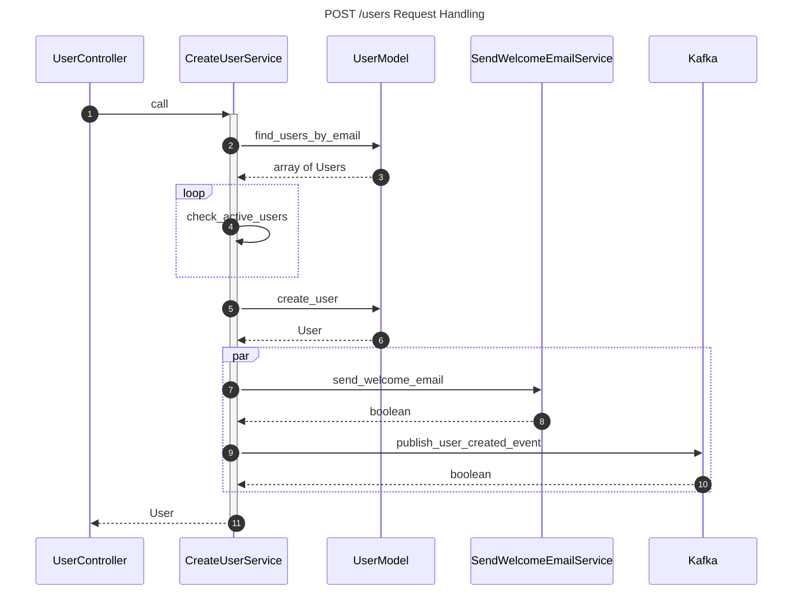
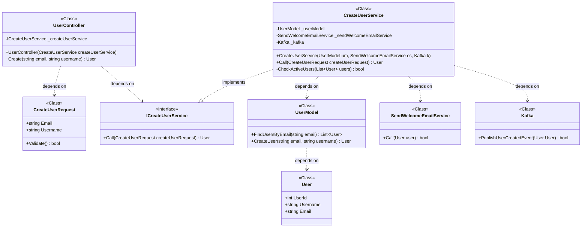

# Use diagrams for code refactoring

## Visualize code flow via sequence diagrams

```text
---
title: POST /users Request Handling
---
sequenceDiagram
    autonumber

    participant UserController
    participant CreateUserService
    participant UserModel
    participant SendWelcomeEmailService
    participant Kafka

    UserController->>+CreateUserService: call
    CreateUserService->>UserModel: find_users_by_email
    UserModel-->>CreateUserService: array of Users

    loop
        CreateUserService->>CreateUserService: check_active_users
    end

    CreateUserService->>UserModel: create_user
    UserModel-->>CreateUserService: User

    par
        CreateUserService->>SendWelcomeEmailService: send_welcome_email
        SendWelcomeEmailService-->>CreateUserService: boolean
        CreateUserService->>Kafka: publish_user_created_event
        Kafka-->>CreateUserService: boolean
    end

    CreateUserService-->>-UserController: User
```



## Refactor based on Class Diagrams

```text
classDiagram
    class UserController {
        <<Class>>
        -ICreateUserService _createUserService
        +UserController(CreateUserService createUserService)
        +Create(string email, string username) User
    }

    class CreateUserRequest {
        <<Class>>
        +string Email
        +string Username
        +Validate() bool
    }

    class ICreateUserService {
        <<Interface>>
        +Call(CreateUserRequest createUserRequest) User
    }

    class CreateUserService {
        <<Class>>
        -UserModel _userModel
        -SendWelcomeEmailService _sendWelcomeEmailService
        -Kafka _kafka
        +CreateUserService(UserModel um, SendWelcomeEmailService es, Kafka k)
        +Call(CreateUserRequest createUserRequest) User
        -CheckActiveUsers(List~User~ users) bool
    }

    class UserModel {
        <<Class>>
        +FindUsersByEmail(string email) List~User~
        +CreateUser(string email, string username) User
    }

    class User {
        <<Class>>
        +int UserId
        +string Username
        +string Email
    }

    class SendWelcomeEmailService {
        <<Class>>
        +Call(User user) bool
    }

    class Kafka {
        <<Class>>
        +PublishUserCreatedEvent(User User) bool
    }

    UserController ..> ICreateUserService: depends on
    UserController ..> CreateUserRequest: depends on
    CreateUserService ..|> ICreateUserService: implements
    CreateUserService ..> UserModel: depends on
    UserModel ..> User: depends on
    CreateUserService ..> SendWelcomeEmailService: depends on
    CreateUserService ..> Kafka: depends on
```


